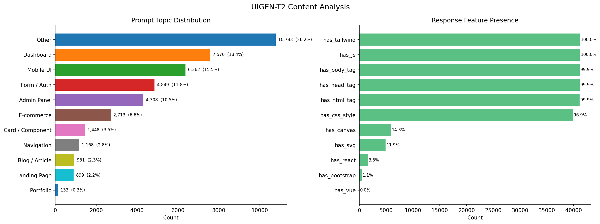
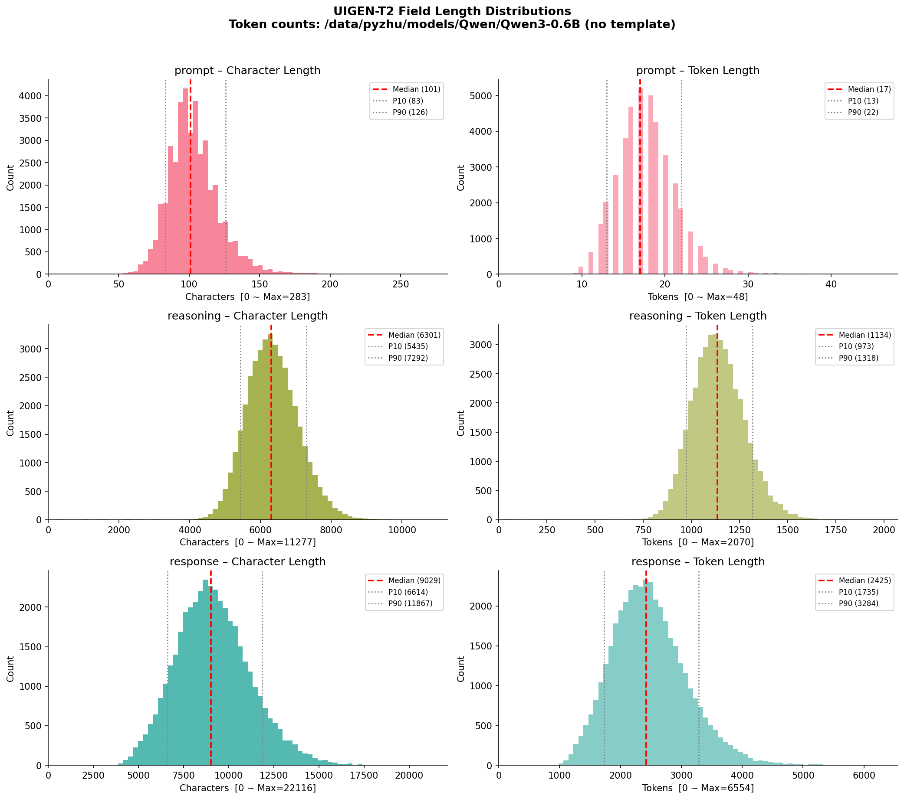
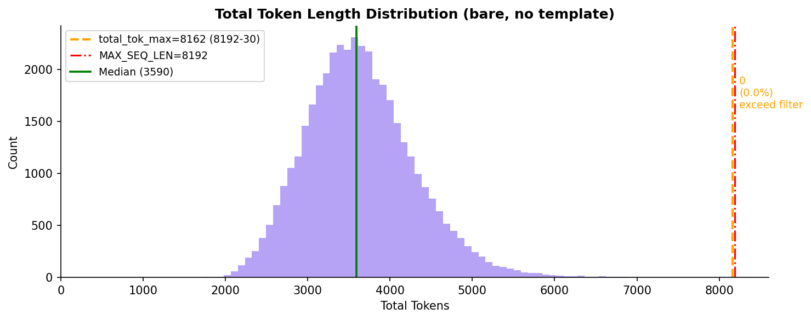
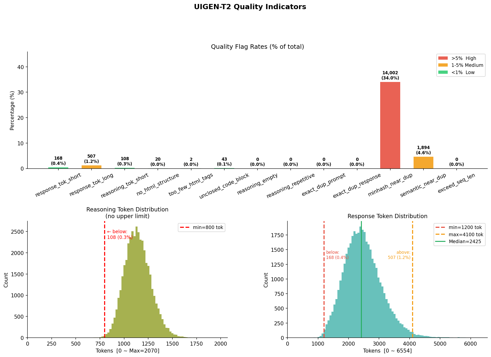
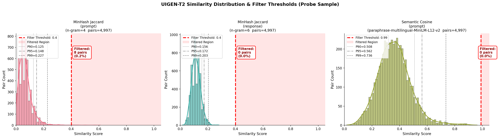
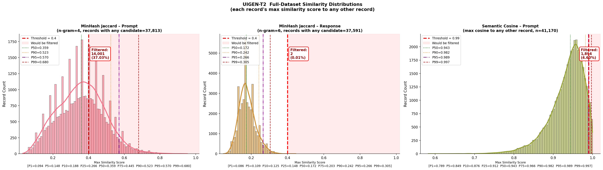
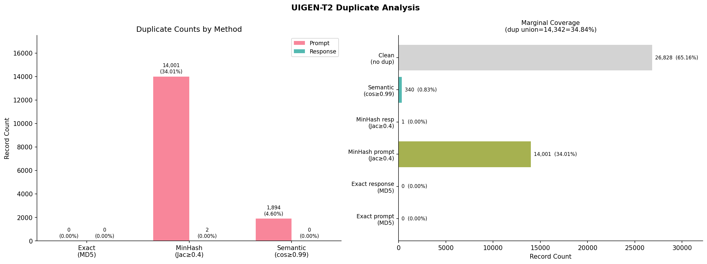
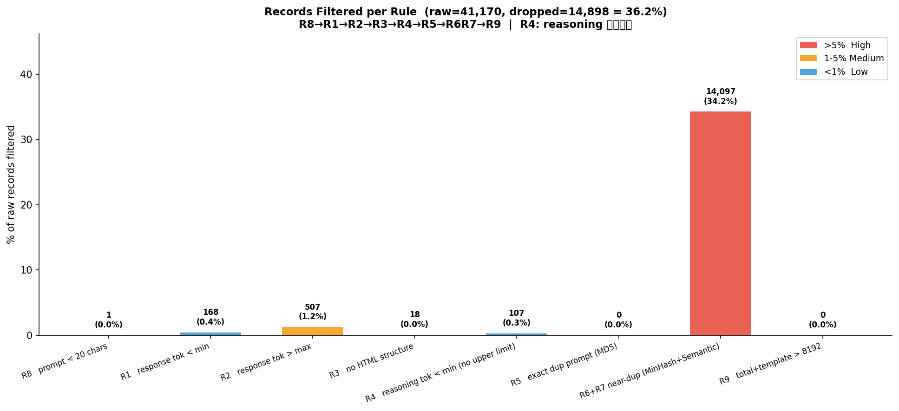
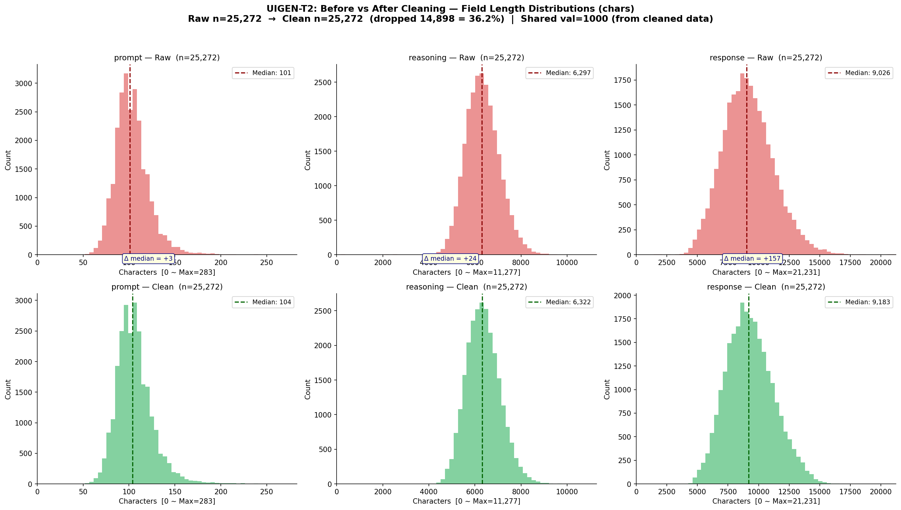
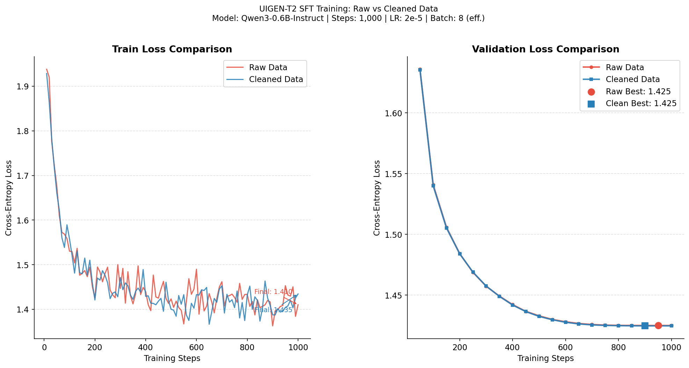

# UIGEN-T2 数据集画像、清洗与 SFT 训练实验报告

## 零、 快速复现指南 (Quick Start)
本项目提供了端到端的自动化脚本，包含完整的复现流程。可通过执行 `run.sh` 脚本或手动运行以下命令，复现本报告中的所有数据、图表与训练结果：

```bash
# 1. 数据画像分析
python 01_data_profiling.py

# 2. 数据清洗与等量重组
python 02_data_cleaning.py

# 3. SFT 训练（原始数据控制组）
python 03_train.py --mode raw --max_steps 1000

# 4. SFT 训练（清洗后数据实验组）
python 03_train.py --mode clean --max_steps 1000

# 5. 绘制 Loss 对比曲线图
python 04_plot_loss.py
```

---

## 一、 数据画像报告 (Data Profiling)

在进行数据清洗前，我们对 `Tesslate/UIGEN-T2` 原始数据集的 41,170 条记录进行了全面的统计画像分析。

### 1. 内容特征与主题分布
数据集的主题分布存在明显的长尾效应。前三大主题（Other, Dashboard, Mobile UI）占据了约 60% 的数据量。在 Response 特征方面，100% 的记录包含了 Tailwind CSS 与 JavaScript，>99.9% 包含标准的 `<html/body/head>` 标签，说明数据集的输出格式高度一致且合规。


*图 1：数据集 Prompt 主题分布与 Response 核心前端特征统计*

### 2. 长度与 Token 消耗分布
基于真实 Tokenizer (`Qwen3-0.6B`) 编码计算：
* **Prompt**：普遍极短，中位数仅 17 tokens（P90=22 tokens）。
* **Reasoning**：长度适中，中位数为 1134 tokens，具备较好的思维链（CoT）厚度。
* **Response**：代码长度较长，中位数为 2425 tokens，涵盖了复杂的 UI 组件库。


*图 2：核心字段的字符长度与 Token 长度分布直方图*


*图 3：拼接模板后的总 Token 长度分布（最大值 7859 未超过 8192 的上下文窗口，无截断风险）*

### 3. 数据质量初探
在进行全量清洗前，我们通过启发式条件对数据集的低质量特征进行了扫描。初步探查显示，存在少部分 Response 长度超标或过短的情况，同时存在少许 HTML 结构不闭合的脏数据。


*图 4：各项启发式质量指标异常占比及 Reasoning/Response 长度阈值切分*

### 4. 数据冗余与相似度分析（核心发现）
本环节是我们诊断数据集质量的最关键步骤。由于 MD5 精确重复量为 0，我们采用了 MinHash 与 Semantic Cosine 进行降维探查。

通过对全量数据的两两最大相似度进行分布扫描，我们发现了惊人的**模板同质化现象**：大量记录的 MinHash Jaccard 分数显著高于 0.4。


*图 5：探查采样的相似度敏感性与阈值切分边界验证*


*图 6：全量数据集相似度分布图。展示了高达 34% 的记录在 Jaccard 阈值 0.4 上具有强烈的近重复候选*

通过图谱验证与全量 LSH/FAISS 检索，最终确认：**有 14,001 条（占比 34.01%）的 Prompt 属于高度近重复数据**。这些指令具有完全一致的句式结构，仅替换了微小的行业名词。若不加处理，模型极易对此类模板产生过度拟合。


*图 7：去重算法拦截拦截数量对比，近重复（MinHash）占据了主导地位*

---

## 二、 详细数据清洗逻辑 (R1-R9) 与动机

基于画像发现的问题，我们设计了一套包含 9 条规则（R1-R9）的工业级数据清洗管线（Pipeline）。该管线兼顾了长度过滤、格式校验、硬匹配去重与模糊去重。

### 1. 规则定义与逻辑说明
* **R1 (Response 长度下限)**：`response_tok < 1200`。过滤结构过于简单的代码，确保训练数据具备足够的 UI 复杂度。
* **R2 (Response 长度上限)**：`response_tok > 4100`。过滤极端冗长的冗余代码，防止模型在推理生成时达到 Max New Tokens 上限而烂尾。
* **R3 (HTML 结构校验)**：正则匹配缺失 `<html>`、`<body>` 等基础标签的残缺片段。
* **R4 (Reasoning 长度下限)**：`reasoning_tok < 800`。CoT 蒸馏的关键在于思考厚度，剔除推理过短的数据。**注意：本规则不设上限**，因为长推演往往意味着高质量的自我纠错。
* **R5 (MD5 精确去重)**：防守底线，应对完全重复脏数据。
* **R6 (MinHash 文本近重复去重)**：`Jaccard ≥ 0.4 (4-gram)`。**本管线核心规则**。解决画像中发现的高达 34% 的“模板套壳” Prompt 问题，大幅削减句式冗余。
* **R7 (Semantic 语义近重复去重)**：基于 Sentence-Transformers 余弦相似度 `≥ 0.99`。拦截纯同义词替换的同质化数据。
* **R8 (Prompt 过短过滤)**：`prompt 字符数 < 20`。拦截缺乏明确描述意图的无效指令。
* **R9 (超长序列截断保护)**：`总 Token 数 + 模板开销 > 8192`。防御性规则，防 OOM。

> **补充说明：为什么语义去重阈值高达 0.99？**  
> 在画像中我们发现，UIGEN-T2 作为 UI 垂直数据集，其指令词汇高度集中。这导致 Prompt 之间存在天然的高语义相似度（如：“设计登录页”与“设计注册页”的向量距离极近，但对应代码完全不同）。若盲目将阈值降至 0.85，将导致存在微小功能差异的指令被严重误杀。因此，我们将 Semantic 阈值保守地定在 0.99 仅用于过滤纯同义词替换，而将主要套壳模板的清理交由对结构敏感的 MinHash (R6) 处理，以此保障微调数据的细粒度辨识力。

### 2. 清洗拦截统计
本次清洗共拦截 **14,898 条（36.2%）** 记录，其中近重复去重拦截了绝对大头（14,097条）。


*图 8：R1-R9 各项清洗规则的具体拦截数量与过滤率占比*

---

## 三、 清洗前后数据统计对比

为保证 SFT 对比实验的绝对公平，我们采用了“等量采样+共享验证集”的控制变量法：
* **Clean 训练集**：清洗后保留的 25,272 条。
* **Raw 训练集**：从原始数据中，排除验证集后**随机等量采样** 25,272 条。
* **共享验证集（Val_shared）**：从高质量清洗数据中分层抽样出独立的 1,000 条，两组模型统一使用该验证集测试。

**核心字段长度分布变迁（字符维度）：**

| 统计拆分 | Prompt (Mean / Median) | Reasoning (Mean / Median) | Response (Mean / Median) |
| :--- | :--- | :--- | :--- |
| **Raw Train (未清洗, 等量)** | 104 / 101 | 6334 / 6297 | 9160 / 9026 |
| **Clean Train (已清洗)** | **106 / 104** | **6359 / 6322** | **9306 / 9183** |

剔除劣质短数据和大量冗余套壳模板后，Clean 数据的整体质量密度上升，各核心字段的平均文本长度出现小幅健康提升。


*图 9：清洗前后 Raw 与 Clean 数据集在 Prompt、Reasoning、Response 维度的长度核密度对比*

---

## 四、 训练配置说明

采用 HuggingFace `Trainer` 框架进行 Standard Fine-tuning (SFT)。
* **基座模型**：`Qwen3-0.6B`
* **硬件环境**：单节点 GPU
* **超参数配置**：
  * Max Steps: 1000
  * Max Sequence Length: 9182
  * Learning Rate: 2e-5 (Cosine Scheduler with 0.05 Warmup Ratio)
  * Effective Batch Size: 8 (Batch 2 × Grad Accum 4)
  * Precision: Mixed Precision (自动适配 FP16/BF16)
* **Label Mask 策略**：仅对 Assistant 的内容（Reasoning + Response）计算 Loss，Prompt 及特殊 Header 标记为 `-100`。

---

## 五、 训练结果与 Loss 对比分析

对 Raw 数据和 Clean 数据分别训练 1000 步，在**相同的验证集**上评估。最终数值如下：

| 数据集 | Initial Train Loss | Final Train Loss | Min Val Loss | Min Val Loss 出现步数 |
| :--- | :--- | :--- | :--- | :--- |
| **Raw (未清洗, 等量)** | 1.9380 | 1.4103 | 1.4250 | 1000 Step |
| **Clean (已清洗)** | 1.9283 | 1.4345 | **1.4247** | **1000 Step** |


*图 10：Raw 与 Clean 数据集在等效步数下的 Train Loss 与 Validation Loss 收敛轨迹对比*

### 📈 实验分析

在控制数据量和训练步数等效的条件下，两组 Loss 曲线高度重合。结合我们在数据画像中的真实探查情况，如实分析原因如下：

1. 训练步数极短，未触发“同质化惩罚”
1000 个 Step 仅让模型遍历了约 8,000 个样本。根据我们在画像脚本中的探查经验：当仅随机抽取 5,000 个样本时，它们之间的相似度极低；只有全量 41k 交叉对比时，才暴露出 34% 的重复率。这说明在短程随机采样中，Raw 组根本还没来得及频繁撞见那些“冗余模板”，模型在两组数据上实际汲取的有效信息量差异不大，因而收敛轨迹完全一致。

2. 垂直任务天然同质化，抹平了早期差异
前端 UI 生成任务的指令天然存在高度“单一性”。这也是为什么在画像阶段，即使我们将 Semantic 语义去重的阈值拉到极其严苛的 0.99，依然能拦截 1,894 条数据（占 4.60%）；而基于字面的 MinHash 更是拦截了 14,001 条套壳模板（占 34.01%），两者去重后的 Union（并集）为 14,097 条（占 34.24%）。
由于任务本身同质化严重，模型前期的核心瓶颈在于掌握基础的 HTML/Tailwind 语法规则，而非细粒度的多样性区分。在这个初步对齐阶段，无论是 Clean 还是 Raw 数据，都能提供充足的基础语法营养，模型双双迅速触及当前的收敛下限（Loss ≈ 1.425），导致曲线未产生分化。

总结：
本次实验如实表明，在不足 1 个 Epoch 的短程 SFT 训练中，大规模去重的收益并不显著。去重清洗的真实价值，在于完整多 Epoch 训练时阻断模型对特定模板的死记硬背。受限于本次 1000 步的实验设定，该长程优势未能体现在 Loss 曲线中。此外，现有的数据清洗策略与相似度度量方法（特别是针对代码结构的专用去重特征）仍有进一步细化与探索的空间。